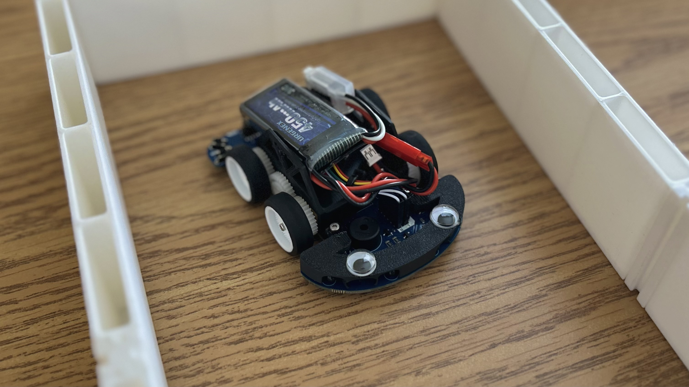
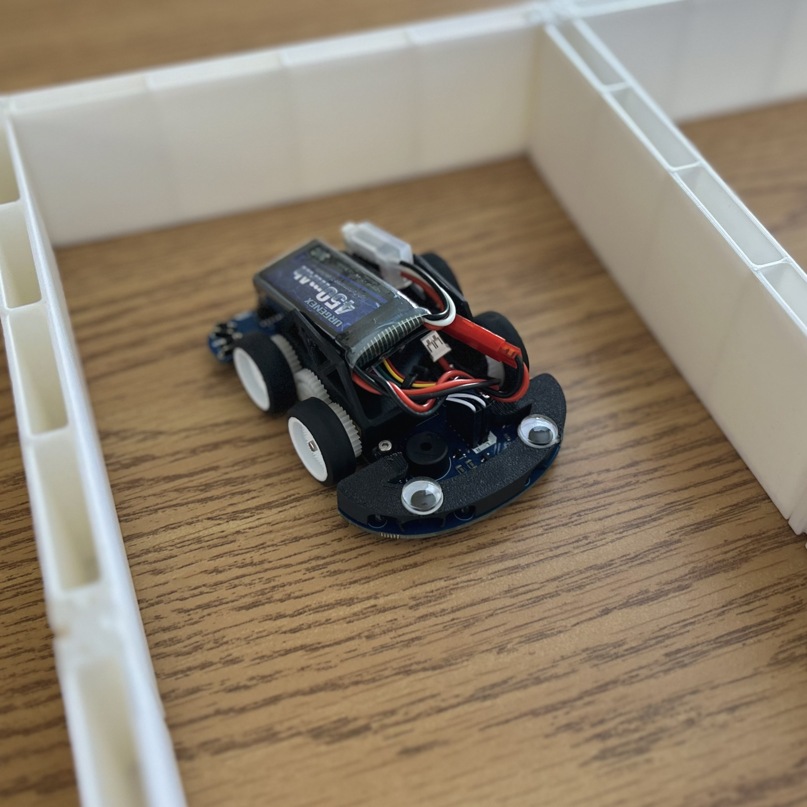
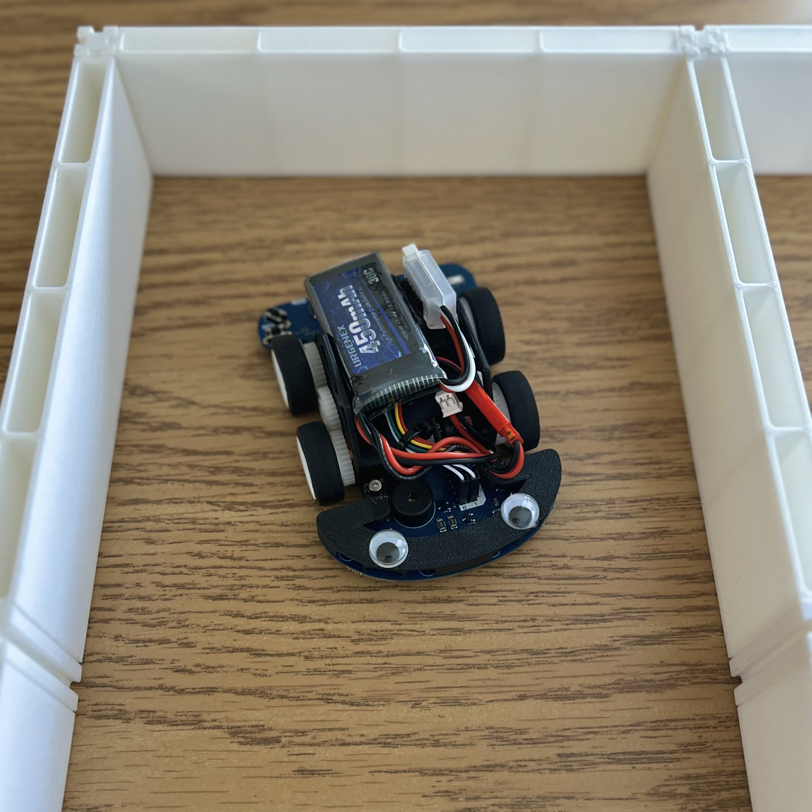

# FrankenMouse

## Introduction

_FrankenMouse_ is a MicroMouse robot that was designed, built, and programmed from scratch by members of the University at Buffalo's IEEE Student Branch.

Some might say that our robot resembles one of Dr. Victor Frankenstein's creations - smaller and more agile, yet equally terrifying. Thus, the name _FrankenMouse_ was born.

### Objective

The objective of a MicroMouse robot is to autonomously nativate and solve a 16x16 maze as fast as possible. To learn more about the MicroMouse competition, check out the excellent [Veritasium Video](https://youtu.be/ZMQbHMgK2rw) on the topic.

## Team

#### Current Collaborators (Versions 2+3):

- [Peter Lilley](https://github.com/petelilley)
  - PCB designs, V2+3 mechanical designs, soldering, 3D printing, assembly, software
- [Eric Butcher](https://github.com/Eric-Butcher)
  - Solver algorithms

#### Former Collaborators (Version 1):

- Dylan Taton
  - V1 mechanical design
- [Sam Chen](https://github.com/SamChen1738)
  - FloodFill algorithm desktop simulation ([MicroMouseSimulator](https://github.com/UBIEEE/MicroMouseSimulator))

## Specs

| Name                | FrankenMouse V2+3                                 |
|-|-|
| Length/Width/Height | 10cm/7cm/3.5cm                                    |
| Weight              | 69 g (w/o batt), 92 g (w/ batt)                   |
| MCU                 | STM32WB55CGU6                                     |
| Motors              | 6V Micro Metal Gearmotor (20:1)                   |
| Encoders            | Micro Metal Motor Encoder (6 pole magnetic discs) |
| Motor Driver        | DRV8835                                           |
| IR Sensors          | SFH4545 (Emitter) + TEFT4300 (Receiver)           |
| IMU                 | ICM-42670-P                                       |
| Tire Diameter       | 2.5 cm                                            |
| Buzzer              | PS1240P02BT                                       |
| Battery             | 2S 450 mAh Li-Po                                  |
| Voltage Regulator   | TPS564208DDCR                                     |
| Connectivity        | SWD, BLE, USB-C (V2 only)                         |

## Robot Versions

- Version 1
  - Custom PCB was designed and manufactured. Assembly problems led to the decision to redesign the robot
- Version 2 (Green PCB)
  - Conceptually different PCB design from V1. Smaller, more compact robot, and better cohesion between PCB and mechanical design
  - Fully assembled and functional robot
- Version 3 (Blue PCB)
  - Minor revisions to V2 PCB including:
    - Fixed the incorrect motor driver wiring to MCU (enable proper hardware PWM control instead of software PWM)
    - Adjusted IR sensor angles for better wall detection
    - Got rid of annoying JST motor/encoder connectors on PCB in favor of simple pin headers
    - Moved SWD connector to not interfere with buttons
    - Removed USB-C connector (not necessary)
    - Added an LED

## Repository Structure

- [`firmware/`](firmware/) - Software running on the robot
- [`hardware/`](hardware/) - PCB designs and mechanical CAD files
- [`simulation/`](simulation/) - Godot-based desktop 3D simulation of the robot
- [`app/`](app/) - iOS/macOS app for controlling the robot over BLE
- [`cli/`](cli/) - Custom interactive shell with command-line tools for controlling the robot over BLE
- [`ti84_controller`](ti84_controller/) - (Silly) TI-84 Plus CE program that communicates with the CLI over a serial connection, used to control the robot

## Gallery

Version 3:

