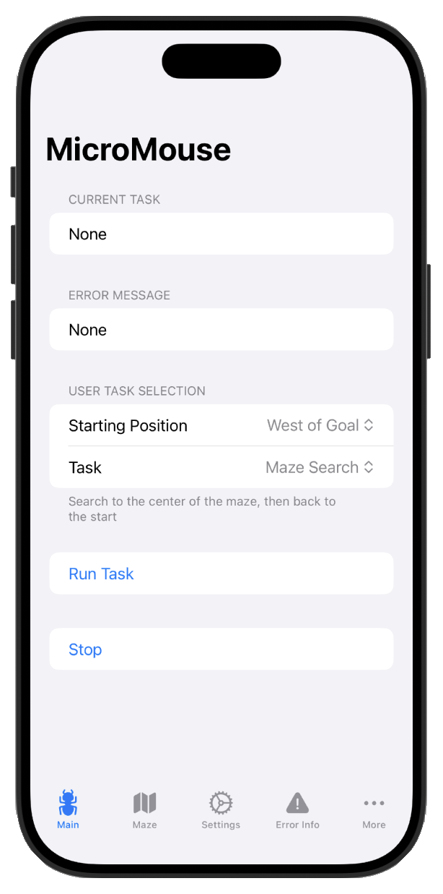

# MicroMouse Dashboard App

This folder contains the code for the MicroMouse dashboard app.

The dashboard app is an iOS/ipadOS/macOS app that is used to visualize diagnostic data from the MicroMouse, and to control the MicroMouse during testing.

The app has a BLE target for communicating with the physical MicroMouse (v2 and v3), and a ROS2 target for communicating with the simulation.

The app is written in Swift using SwiftUI, with some Objective-C++ for interfacing with ROS2.

## Building (BLE Target)

Select the __MicroMouse Dashboard BLE__ target in Xcode, and build for either iOS, ipadOS, or macOS. iOS 18 / macOS Sequoia is required.

## Building (ROS2 Target)

Linking an Xcode project with ROS2 is nearly impossible, so the code that interfaces with ROS2 is compiled as a dynamic library with CMake, and then linked with the Xcode project.

Before opening Xcode, run a CMake build on the `MicroMouseDashboard/Feedback/ROS2` directory to build the dylib. It it recommended that you specify the build directory as somewhere outside of the Xcode project directory so that Xcode doesn't get confused by the CMake build files. Choose `/tmp/build` or something, it won't matter - the CMakeLists.txt will make sure that the dylib is placed in the right location regardless of the build directory.

When you open Xcode, ensure that the dylib is listed under the "Frameworks, Libraries, and Embedded Content" section of the MicroMouseDashboard ROS2 target, and that it is set to either "Embed & Sign" or "Embed Without Signing". Also make sure that the MicroMouseDashboard BLE target did not automatically disciver the dylib and decide to link with it.

Select the __MicroMouse Dashboard ROS2__ target in Xcode, and build for macOS.
