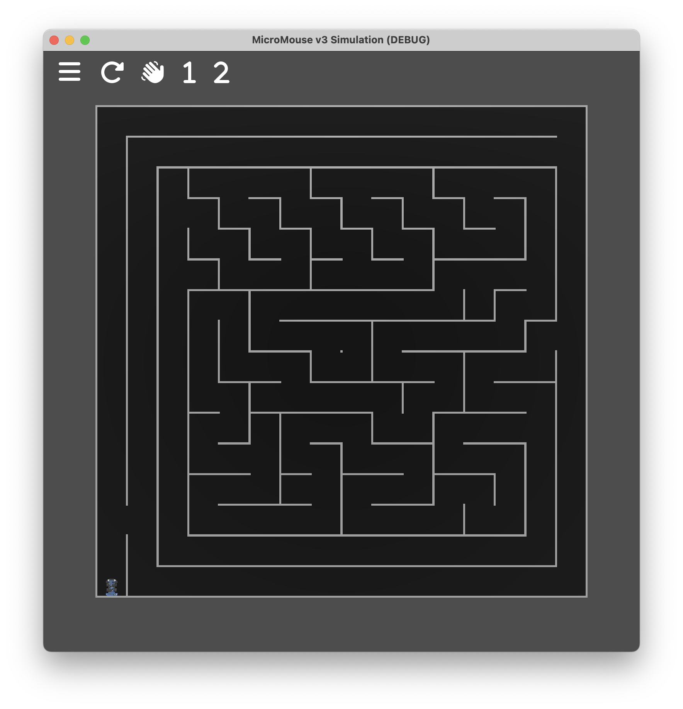

# Simulatior



This folder contains the code for the MicroMouse v3 simulator.

The simulator is a 3D simulation of the MicroMouse made in [Godot](https://godotengine.org/). It is used to test the firmware run on the physical MicroMouse, but in a more controlled environment.

The simulator is made to be run alongside a simulation build of the [firmware](../../firmware/README.md) and the [dashboard app](../../app/README.md). The simulator is controlled through ROS2 topics.

Godot version 4.4 is required.

## Building

Even though the simulator is a Godot project, the logic built as a GDExtension in C++. To build the extension, use CMake:
```
cmake . -Bbuild
cmake --build build
```

Now open the Godot project in the `simulator` directory, and run the main scene.

You can build the simulator into a standalone executable from Godot.

## Usage

Toggle maze walls by clicking in between the posts. Save a maze configuration by clicking the hamburger menu in the top left corner, and then clicking `Save Maze`. Load a maze configuration by clicking `Open Maze`.

Reset the mouse's position and velocity in the simulation by clicking the reset button.

Simulate a hand wave in front of the IR sensors by clicking/holding the hand button.

Simulate a button press by clicking/holding the `1` or the `2` button.
